# Proposal Aplikasi Backoffice Travel Umroh

---

# 1. Overview

## Latar Belakang

Operasional travel umroh umumnya melibatkan banyak proses administratif, seperti:

- Pendaftaran jamaah
- Pengelolaan paket keberangkatan
- Booking seat
- Pembayaran DP / cicilan / pelunasan
- Pengelolaan dokumen passport
- Penyusunan manifest
- Monitoring referral reward
- Monitoring revenue perusahaan

Proses yang masih manual berpotensi menimbulkan:

- Human error
- Double booking seat
- Data pembayaran tidak sinkron
- Sulit monitoring jamaah belum lunas
- Sulit tracking referral dan free seat

Aplikasi ini dibuat untuk membantu operasional travel agar lebih terstruktur, cepat, dan terukur.

---

## Struktur Menu Sistem

```text
Dashboard

Master Data
 ├── Jamaah
 ├── Paket Program
 ├── Agen

Booking
 ├── Booking
 ├── Seat Monitoring

Finance
 ├── Invoice
 ├── Payment
 ├── Outstanding

Operations
 ├── Manifest
 ├── Passport Documents

Marketing
 ├── Referral Reward

Reports
 ├── Revenue
 ├── Departure Report

Settings
 ├── User Management
 ├── Roles & Permission
```

---

# 2. Effort Task & Mandays

| No | Menu | Task | Mandays |
|----|------|------|---------:|
| 1 | Dashboard | Dashboard KPI Summary | 1 |
| 2 | Dashboard | Recent Activity | 1 |
| 3 | Dashboard | Alert Notification | 1 |
| 4 | Master Data > Jamaah | Create Data Jamaah | 1 |
| 5 | Master Data > Jamaah | Read List Data Jamaah | 1 |
| 6 | Master Data > Jamaah | Read Detail Data Jamaah | 1 |
| 7 | Master Data > Jamaah | Update Data Jamaah | 1 |
| 8 | Master Data > Jamaah | Delete Data Jamaah | 0.5 |
| 9 | Master Data > Jamaah | Search & Filter Jamaah | 1 |
| 10 | Master Data > Jamaah | Upload Passport / Documents | 1.5 |
| 11 | Master Data > Paket Program | Create Paket Program | 1 |
| 12 | Master Data > Paket Program | Read List Paket Program | 1 |
| 13 | Master Data > Paket Program | Read Detail Paket Program | 1 |
| 14 | Master Data > Paket Program | Update Paket Program | 1 |
| 15 | Master Data > Paket Program | Delete Paket Program | 0.5 |
| 16 | Master Data > Paket Program | Package Quota Management | 1 |
| 17 | Master Data > Paket Program | Package Price Management | 1 |
| 18 | Master Data > Agen | Create Agen | 0.5 |
| 19 | Master Data > Agen | Read List Agen | 0.5 |
| 20 | Master Data > Agen | Read Detail Agen | 0.5 |
| 21 | Master Data > Agen | Update Agen | 0.5 |
| 22 | Master Data > Agen | Delete Agen | 0.5 |
| 23 | Master Data > Agen | Agent Performance View | 1 |
| 24 | Booking > Booking | Create Booking | 1.5 |
| 25 | Booking > Booking | Read Booking List | 1 |
| 26 | Booking > Booking | Read Booking Detail | 1 |
| 27 | Booking > Booking | Update Booking Status | 1 |
| 28 | Booking > Booking | Cancel Booking | 1 |
| 29 | Booking > Booking | Booking Validation | 1 |
| 30 | Booking > Seat Monitoring | Seat Occupancy Calculation | 1 |
| 31 | Booking > Seat Monitoring | Seat Availability Monitoring | 1 |
| 32 | Booking > Seat Monitoring | Seat Alert | 1 |
| 33 | Finance > Invoice | Generate Invoice | 1 |
| 34 | Finance > Invoice | Preview Invoice | 1 |
| 35 | Finance > Invoice | Download PDF Invoice | 1.5 |
| 36 | Finance > Payment | Create DP Payment | 1 |
| 37 | Finance > Payment | Create Installment Payment | 1.5 |
| 38 | Finance > Payment | Create Full Payment | 1 |
| 39 | Finance > Payment | Upload Payment Proof | 1 |
| 40 | Finance > Payment | Payment History | 1 |
| 41 | Finance > Outstanding | Outstanding List | 1 |
| 42 | Finance > Outstanding | Outstanding Detail | 1 |
| 43 | Finance > Outstanding | H-35 Due Monitoring | 1.5 |
| 44 | Finance > Outstanding | Outstanding Alert | 1 |
| 45 | Operations > Manifest | Generate Excel Manifest | 1 |
| 46 | Operations > Manifest | Generate PDF Manifest | 1 |
| 47 | Operations > Manifest | Package Filter | 1 |
| 48 | Operations > Passport Documents | Download Single Passport | 1 |
| 49 | Operations > Passport Documents | Bulk Download ZIP | 2 |
| 50 | Marketing > Referral Reward | Assign Referrer | 1 |
| 51 | Marketing > Referral Reward | Referral Tracking | 1 |
| 52 | Marketing > Referral Reward | Referral Qualification Engine | 2 |
| 53 | Marketing > Referral Reward | Claim Free Seat | 1.5 |
| 54 | Reports > Revenue | Revenue Summary | 1 |
| 55 | Reports > Revenue | Revenue Per Package | 1 |
| 56 | Reports > Revenue | Revenue Per Agent | 1 |
| 57 | Reports > Departure Report | Departure Summary | 1 |
| 58 | Reports > Departure Report | Departure Detail | 1 |
| 59 | Reports > Departure Report | Export Report | 1 |
| 60 | Settings > User Management | Create User | 1 |
| 61 | Settings > User Management | Update User | 1 |
| 62 | Settings > User Management | Disable User | 1 |
| 63 | Settings > Roles & Permission | Create Role | 1 |
| 64 | Settings > Roles & Permission | Assign Permission | 1 |
| 65 | Settings > Roles & Permission | Update Permission | 1 |
| 66 | System | Functional Testing | 3 |
| 67 | System | Bug Fixing | 2 |
| 68 | System | Deployment | 2 |
|  |  | **TOTAL** | **± 65 MD** |
---

# 3. ERD

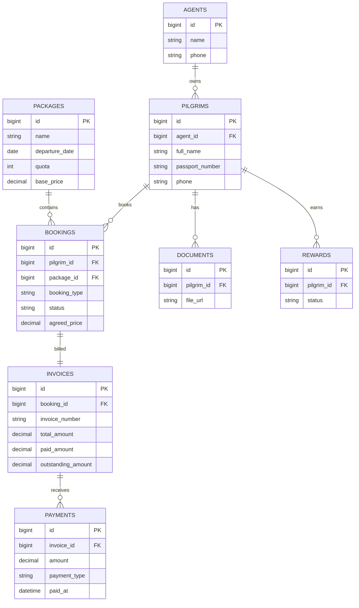
```mermaid
erDiagram

    AGENTS ||--o{ PILGRIMS : owns
    PILGRIMS ||--o{ BOOKINGS : books
    PACKAGES ||--o{ BOOKINGS : contains

    BOOKINGS ||--|| INVOICES : billed
    INVOICES ||--o{ PAYMENTS : receives

    PILGRIMS ||--o{ DOCUMENTS : has
    PILGRIMS ||--o{ REWARDS : earns


    AGENTS {
        bigint id PK
        string name
        string phone
    }

    PILGRIMS {
        bigint id PK
        bigint agent_id FK
        string full_name
        string passport_number
        string phone
    }

    PACKAGES {
        bigint id PK
        string name
        date departure_date
        int quota
        decimal base_price
    }

    BOOKINGS {
        bigint id PK
        bigint pilgrim_id FK
        bigint package_id FK
        string booking_type
        string status
        decimal agreed_price
    }

    INVOICES {
        bigint id PK
        bigint booking_id FK
        string invoice_number
        decimal total_amount
        decimal paid_amount
        decimal outstanding_amount
    }

    PAYMENTS {
        bigint id PK
        bigint invoice_id FK
        decimal amount
        string payment_type
        datetime paid_at
    }

    DOCUMENTS {
        bigint id PK
        bigint pilgrim_id FK
        string file_url
    }

    REWARDS {
        bigint id PK
        bigint pilgrim_id FK
        string status
    }
```

---

# 4. High Level Business Sequence Diagram

---

# Dashboard

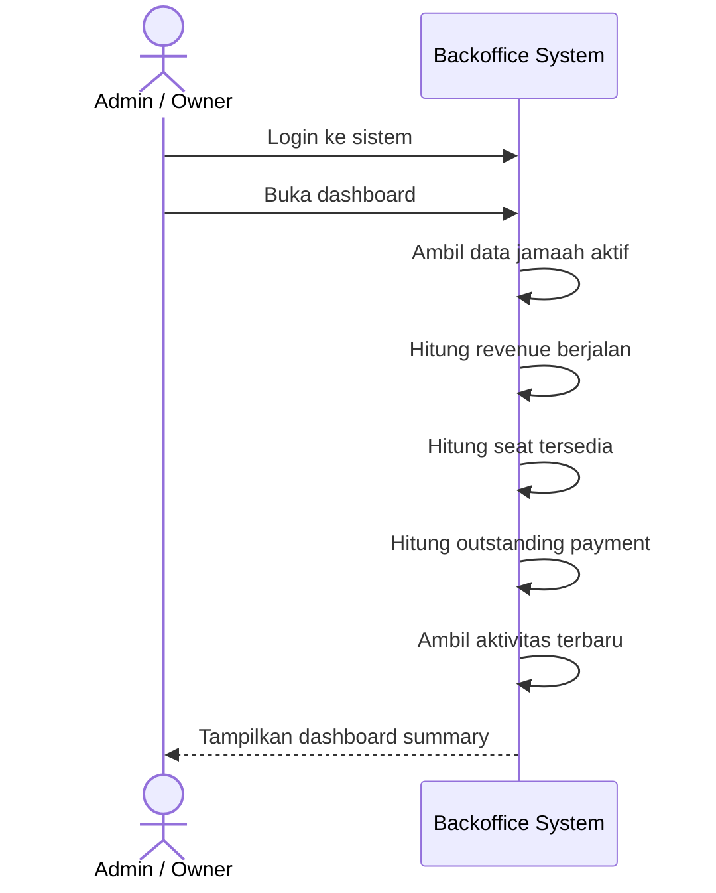
```mermaid
sequenceDiagram

    actor User as Admin / Owner
    participant System as Backoffice System

    User->>System: Login ke sistem
    User->>System: Buka dashboard

    System->>System: Ambil data jamaah aktif
    System->>System: Hitung revenue berjalan
    System->>System: Hitung seat tersedia
    System->>System: Hitung outstanding payment
    System->>System: Ambil aktivitas terbaru

    System-->>User: Tampilkan dashboard summary
```

---

# Master Data → Jamaah

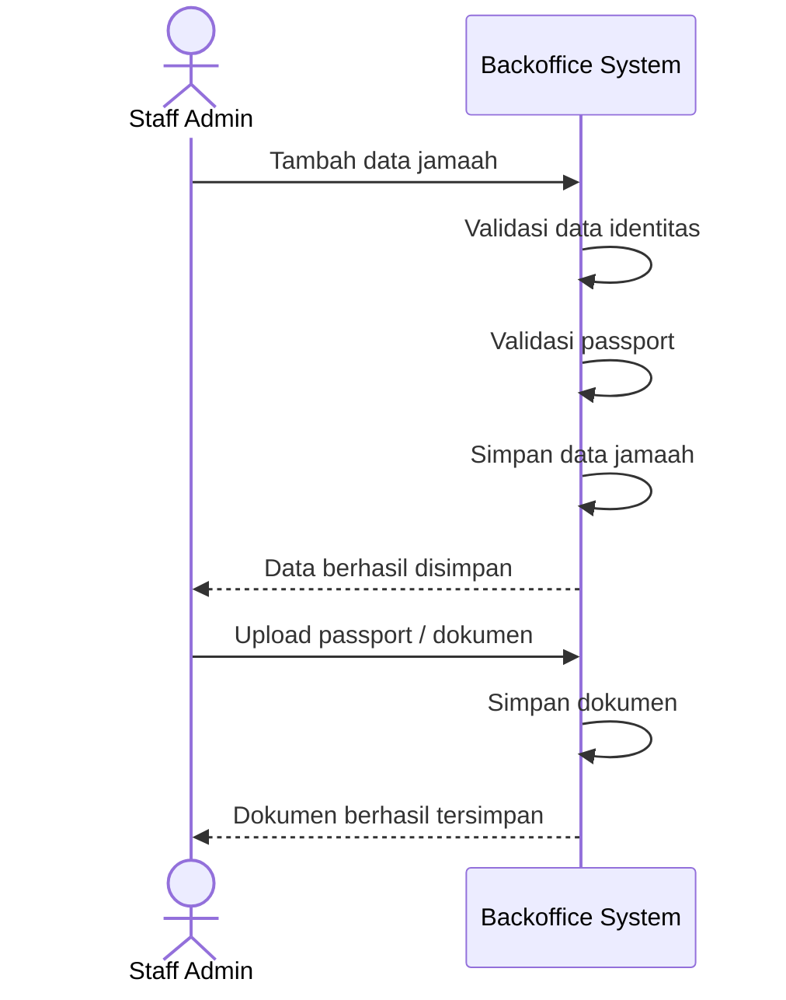
```mermaid
sequenceDiagram

    actor Admin as Staff Admin
    participant System as Backoffice System

    Admin->>System: Tambah data jamaah

    System->>System: Validasi data identitas
    System->>System: Validasi passport
    System->>System: Simpan data jamaah

    System-->>Admin: Data berhasil disimpan

    Admin->>System: Upload passport / dokumen

    System->>System: Simpan dokumen

    System-->>Admin: Dokumen berhasil tersimpan
```

---

# Master Data → Paket Program

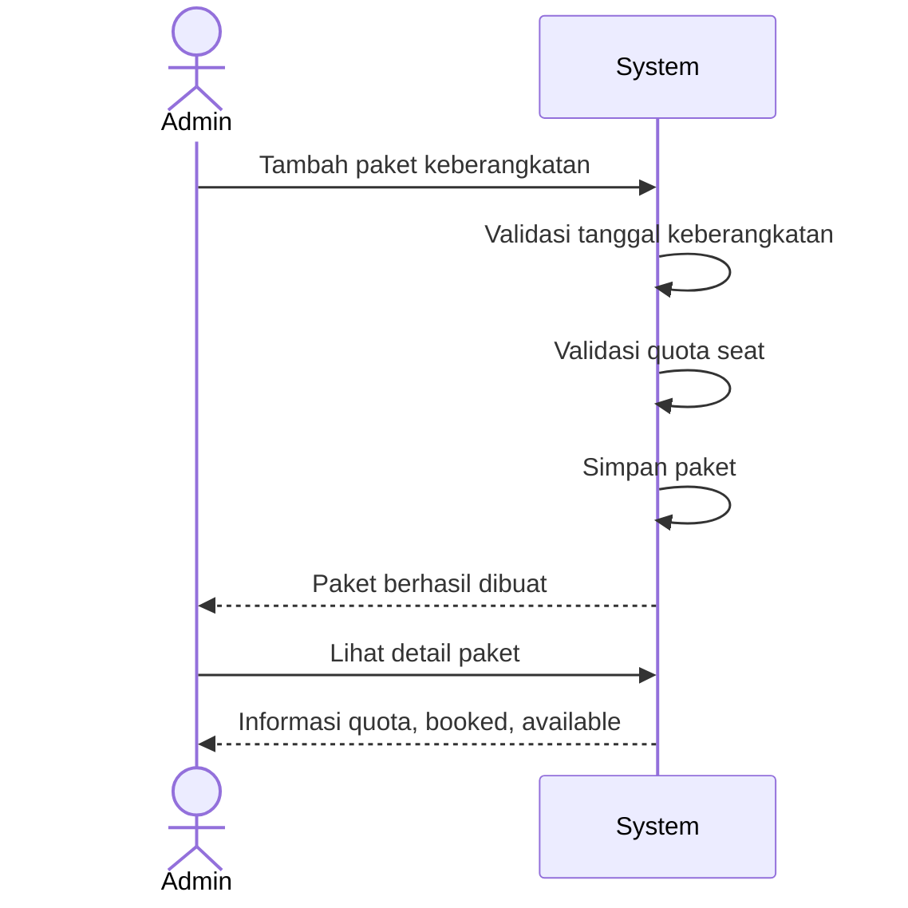
```mermaid
sequenceDiagram

    actor Admin
    participant System

    Admin->>System: Tambah paket keberangkatan

    System->>System: Validasi tanggal keberangkatan
    System->>System: Validasi quota seat
    System->>System: Simpan paket

    System-->>Admin: Paket berhasil dibuat

    Admin->>System: Lihat detail paket

    System-->>Admin: Informasi quota, booked, available
```

---

# Master Data → Agen

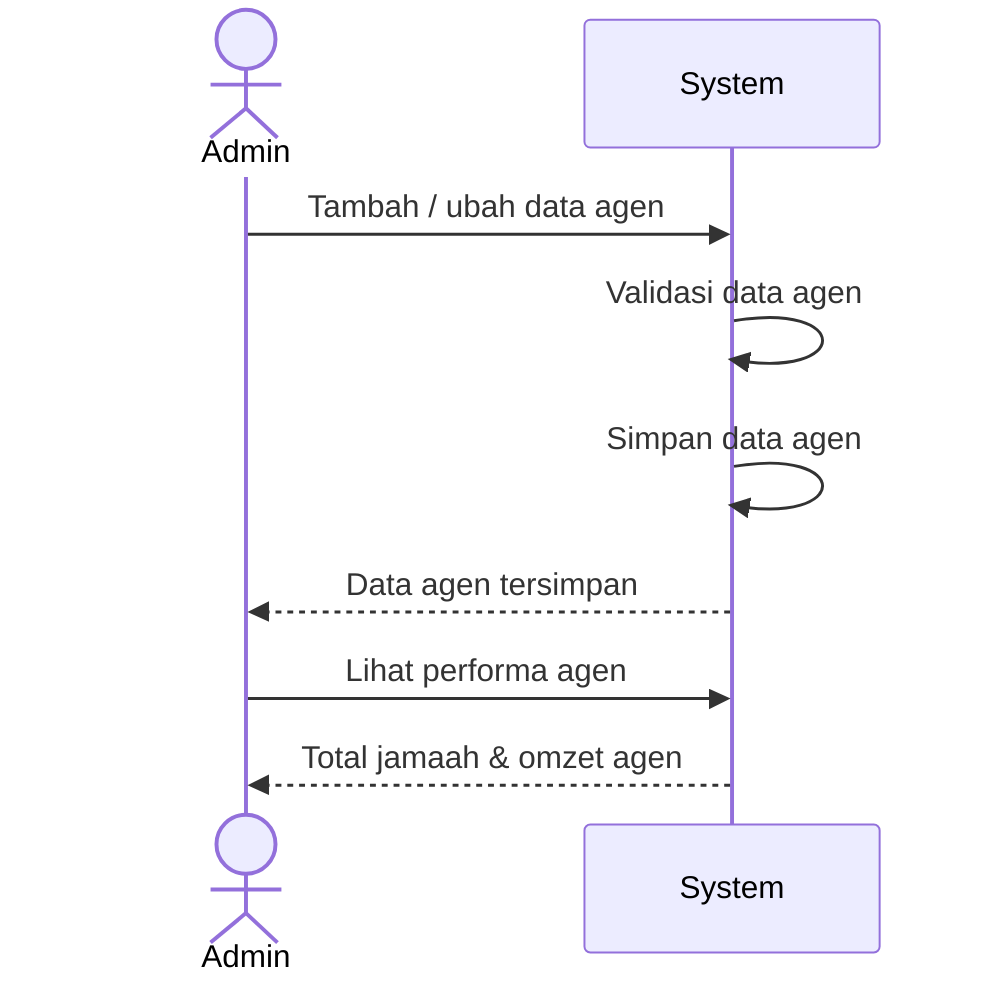
```mermaid
sequenceDiagram

    actor Admin
    participant System

    Admin->>System: Tambah / ubah data agen

    System->>System: Validasi data agen
    System->>System: Simpan data agen

    System-->>Admin: Data agen tersimpan

    Admin->>System: Lihat performa agen

    System-->>Admin: Total jamaah & omzet agen
```

---

# Booking

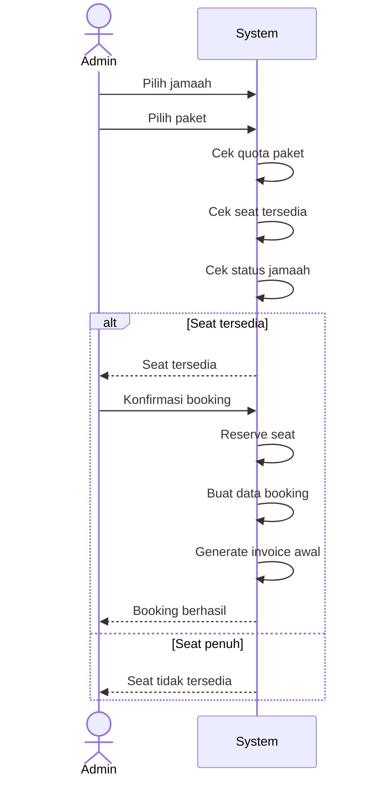
```mermaid
sequenceDiagram

    actor Admin
    participant System

    Admin->>System: Pilih jamaah
    Admin->>System: Pilih paket

    System->>System: Cek quota paket
    System->>System: Cek seat tersedia
    System->>System: Cek status jamaah

    alt Seat tersedia
        System-->>Admin: Seat tersedia

        Admin->>System: Konfirmasi booking

        System->>System: Reserve seat
        System->>System: Buat data booking
        System->>System: Generate invoice awal

        System-->>Admin: Booking berhasil
    else Seat penuh
        System-->>Admin: Seat tidak tersedia
    end
```

---

# Seat Monitoring

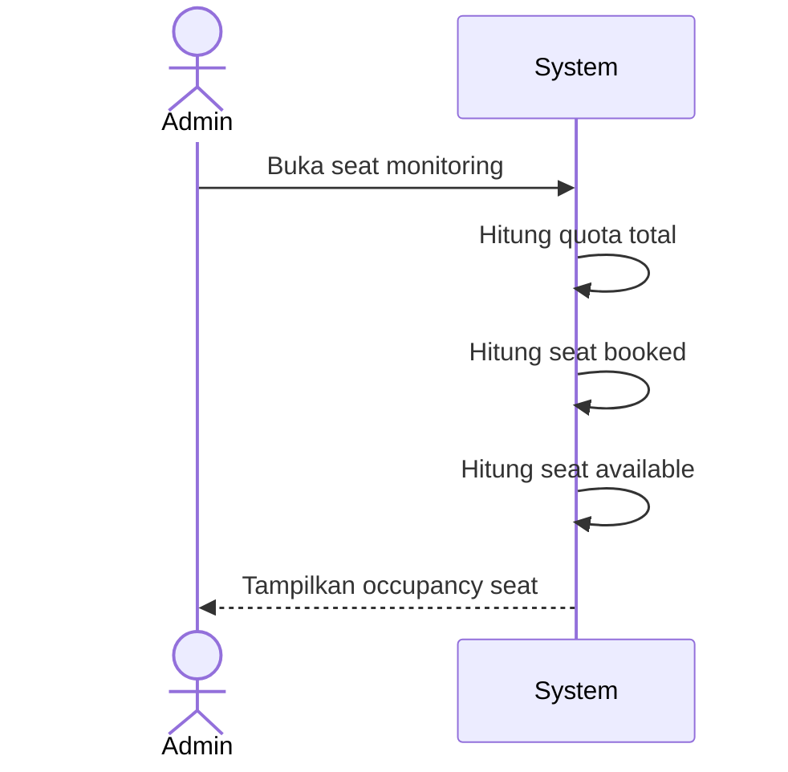
```mermaid
sequenceDiagram

    actor Admin
    participant System

    Admin->>System: Buka seat monitoring

    System->>System: Hitung quota total
    System->>System: Hitung seat booked
    System->>System: Hitung seat available

    System-->>Admin: Tampilkan occupancy seat
```

---

# Finance → Invoice

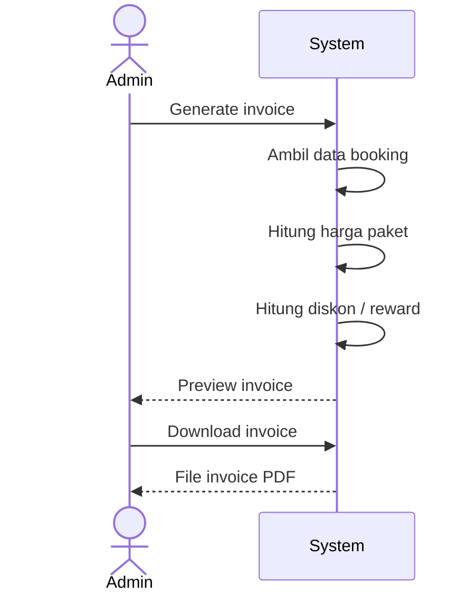
```mermaid
sequenceDiagram

    actor Admin
    participant System

    Admin->>System: Generate invoice

    System->>System: Ambil data booking
    System->>System: Hitung harga paket
    System->>System: Hitung diskon / reward

    System-->>Admin: Preview invoice

    Admin->>System: Download invoice

    System-->>Admin: File invoice PDF
```

---

# Finance → Payment

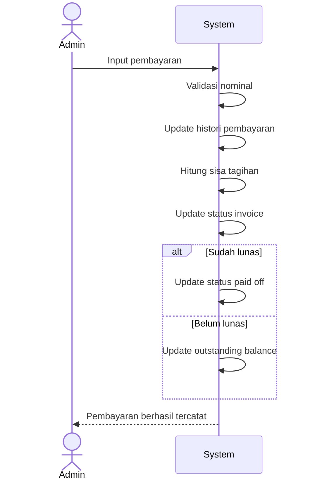
```mermaid
sequenceDiagram

    actor Admin
    participant System

    Admin->>System: Input pembayaran

    System->>System: Validasi nominal
    System->>System: Update histori pembayaran
    System->>System: Hitung sisa tagihan
    System->>System: Update status invoice

    alt Sudah lunas
        System->>System: Update status paid off
    else Belum lunas
        System->>System: Update outstanding balance
    end

    System-->>Admin: Pembayaran berhasil tercatat
```

---

# Finance → Outstanding

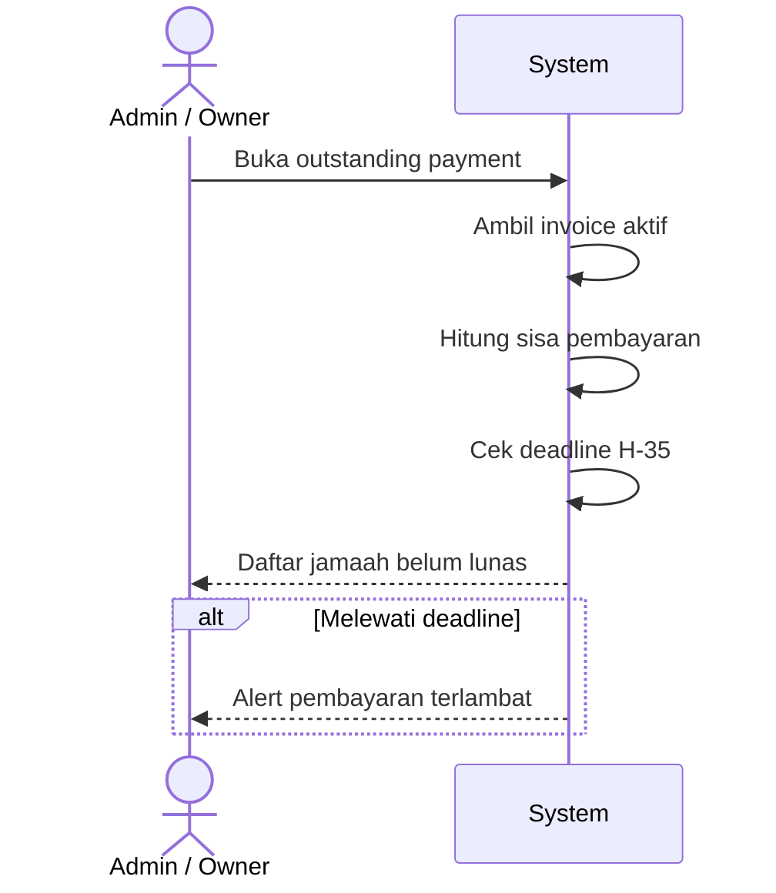
```mermaid
sequenceDiagram

    actor User as Admin / Owner
    participant System

    User->>System: Buka outstanding payment

    System->>System: Ambil invoice aktif
    System->>System: Hitung sisa pembayaran
    System->>System: Cek deadline H-35

    System-->>User: Daftar jamaah belum lunas

    alt Melewati deadline
        System-->>User: Alert pembayaran terlambat
    end
```

---

# Operations → Manifest

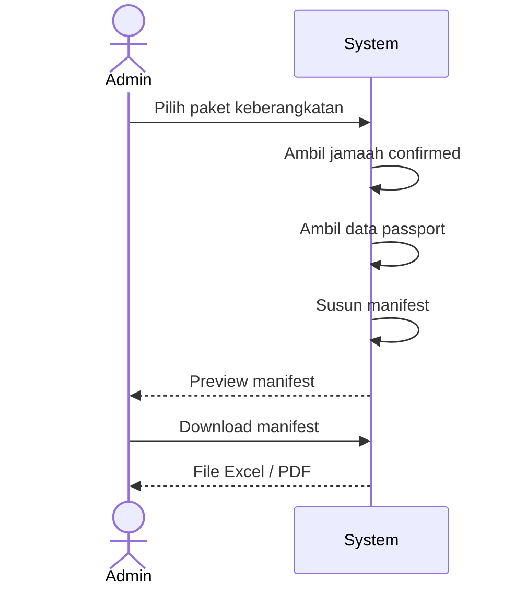
```mermaid
sequenceDiagram

    actor Admin
    participant System

    Admin->>System: Pilih paket keberangkatan

    System->>System: Ambil jamaah confirmed
    System->>System: Ambil data passport
    System->>System: Susun manifest

    System-->>Admin: Preview manifest

    Admin->>System: Download manifest

    System-->>Admin: File Excel / PDF
```

---

# Operations → Passport Documents

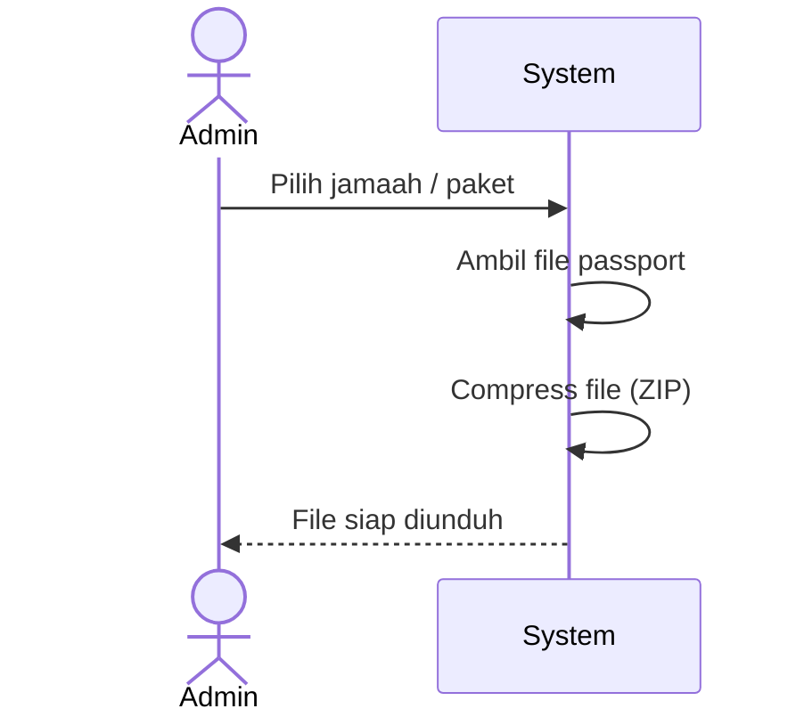
```mermaid
sequenceDiagram

    actor Admin
    participant System

    Admin->>System: Pilih jamaah / paket

    System->>System: Ambil file passport
    System->>System: Compress file (ZIP)

    System-->>Admin: File siap diunduh
```

---

# Marketing → Referral Reward

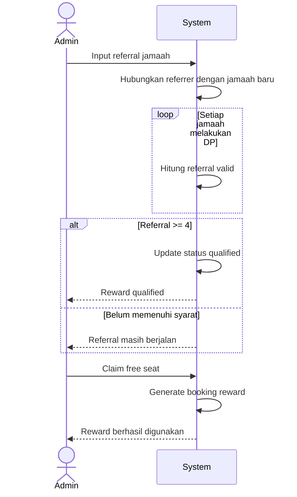
```mermaid
sequenceDiagram

    actor Admin
    participant System

    Admin->>System: Input referral jamaah

    System->>System: Hubungkan referrer dengan jamaah baru

    loop Setiap jamaah melakukan DP
        System->>System: Hitung referral valid
    end

    alt Referral >= 4
        System->>System: Update status qualified
        System-->>Admin: Reward qualified
    else Belum memenuhi syarat
        System-->>Admin: Referral masih berjalan
    end

    Admin->>System: Claim free seat

    System->>System: Generate booking reward

    System-->>Admin: Reward berhasil digunakan
```

---

# Reports → Revenue

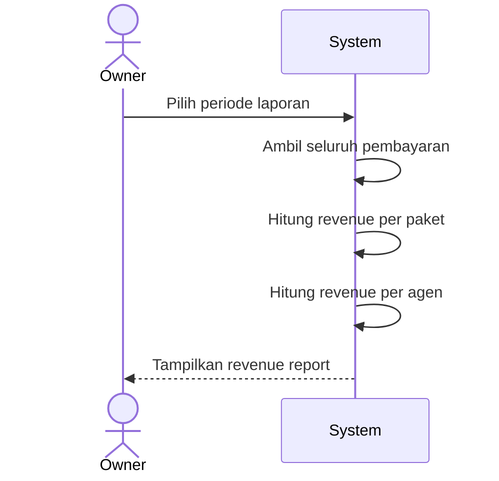
```mermaid
sequenceDiagram

    actor Owner
    participant System

    Owner->>System: Pilih periode laporan

    System->>System: Ambil seluruh pembayaran
    System->>System: Hitung revenue per paket
    System->>System: Hitung revenue per agen

    System-->>Owner: Tampilkan revenue report
```

---

# Reports → Departure Report

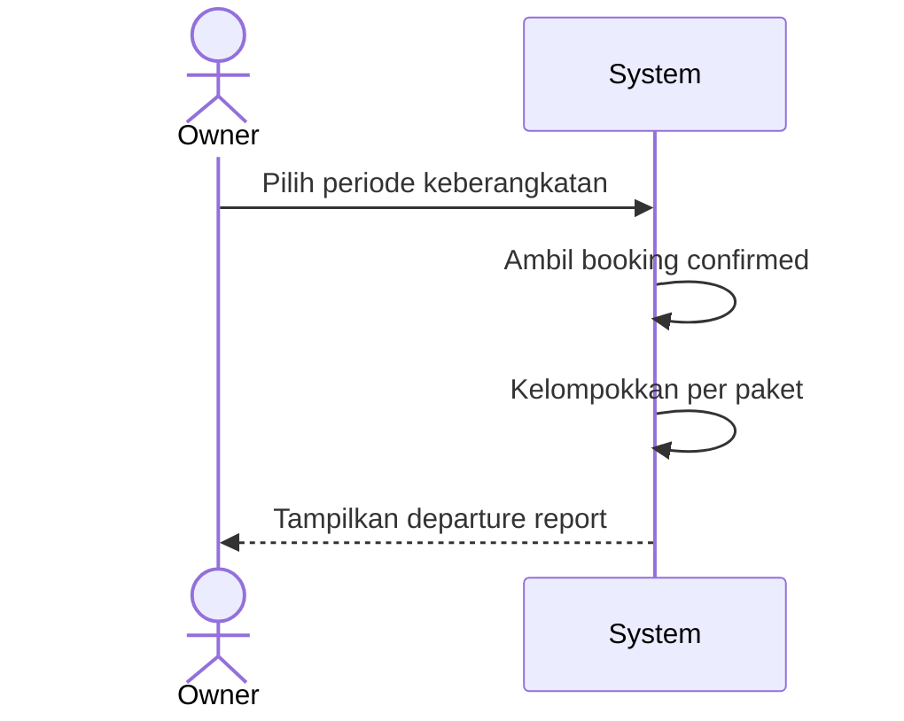
```mermaid
sequenceDiagram

    actor Owner
    participant System

    Owner->>System: Pilih periode keberangkatan

    System->>System: Ambil booking confirmed
    System->>System: Kelompokkan per paket

    System-->>Owner: Tampilkan departure report
```

---

# Settings → User Management

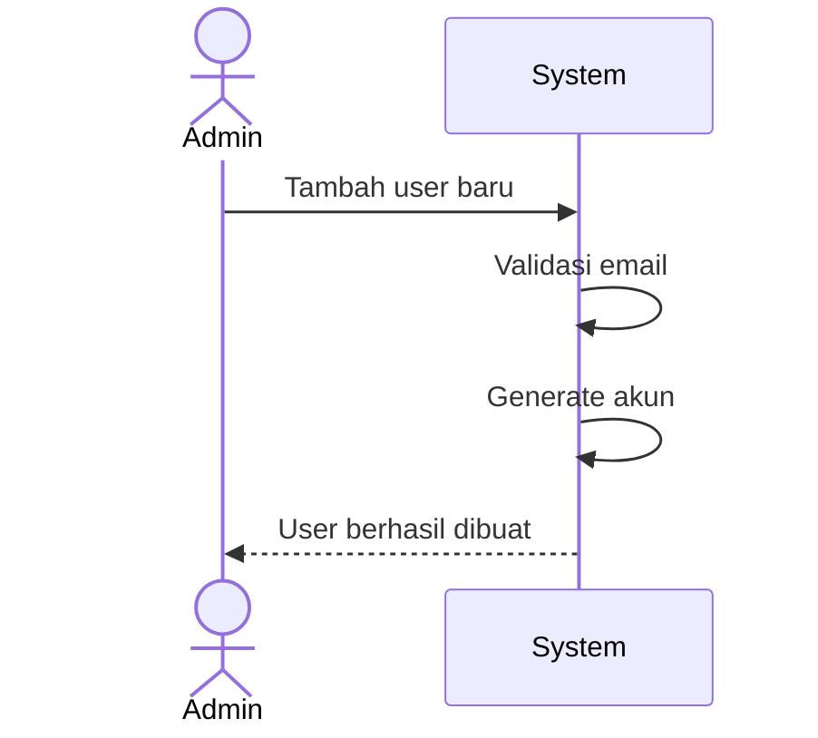
```mermaid
sequenceDiagram

    actor Admin
    participant System

    Admin->>System: Tambah user baru

    System->>System: Validasi email
    System->>System: Generate akun

    System-->>Admin: User berhasil dibuat
```

---

# Settings → Roles & Permission

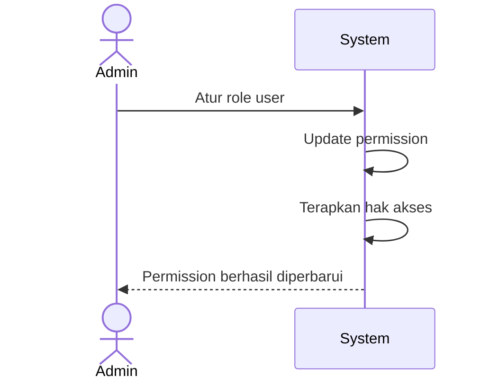
```mermaid
sequenceDiagram

    actor Admin
    participant System

    Admin->>System: Atur role user

    System->>System: Update permission
    System->>System: Terapkan hak akses

    System-->>Admin: Permission berhasil diperbarui
```
